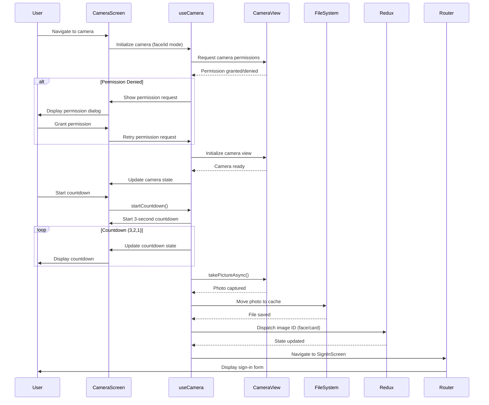
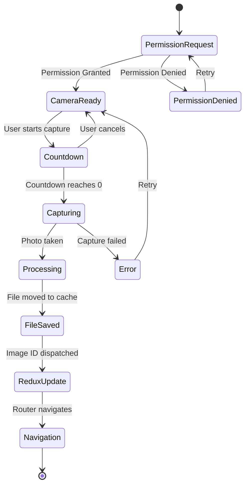
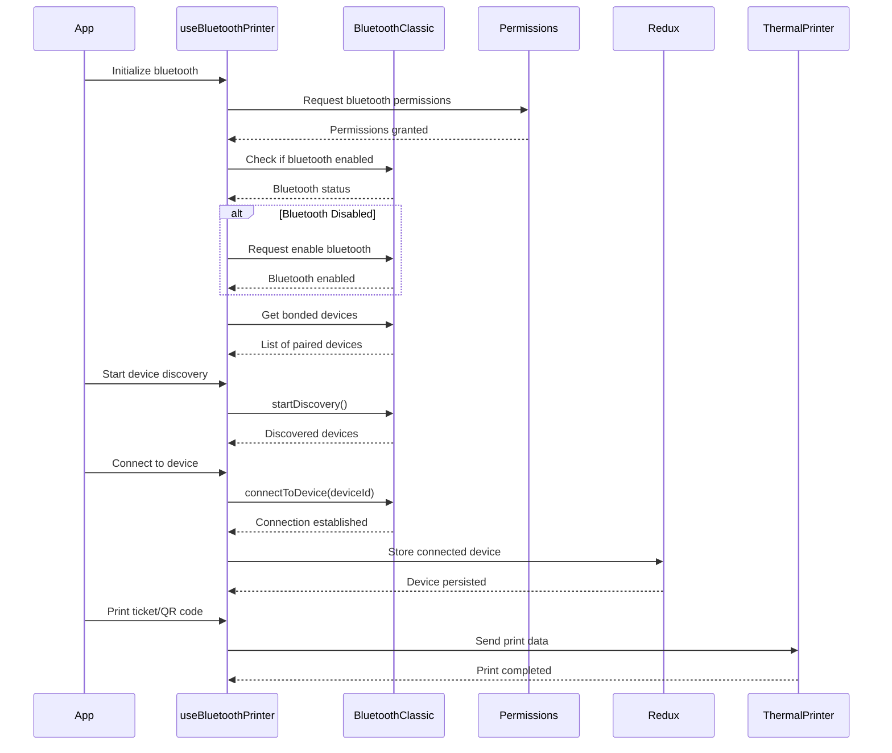
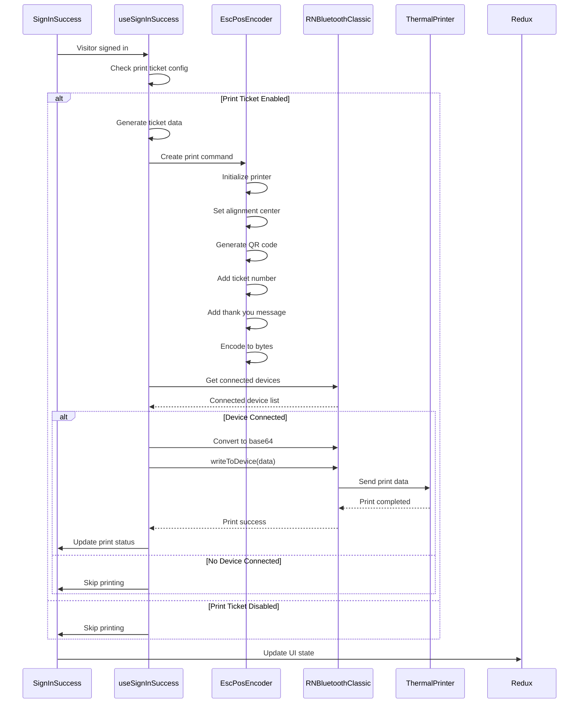
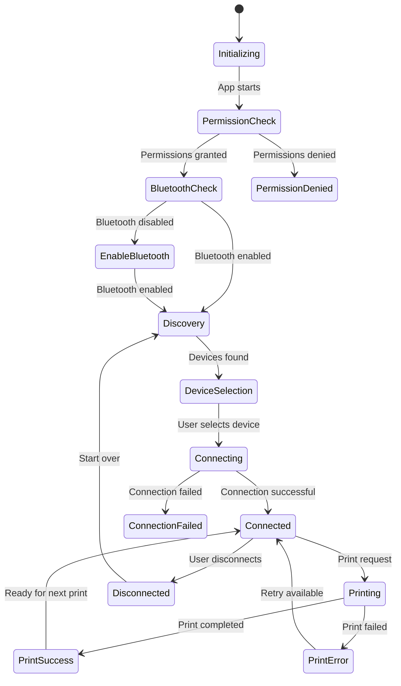
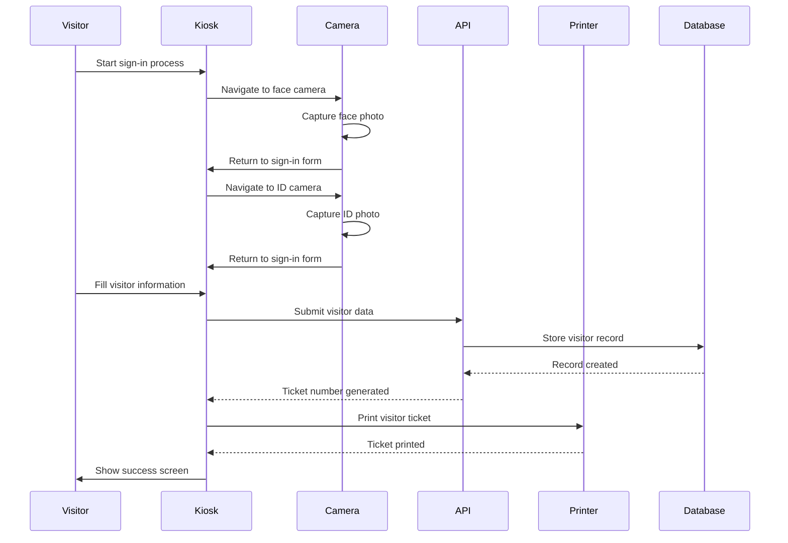
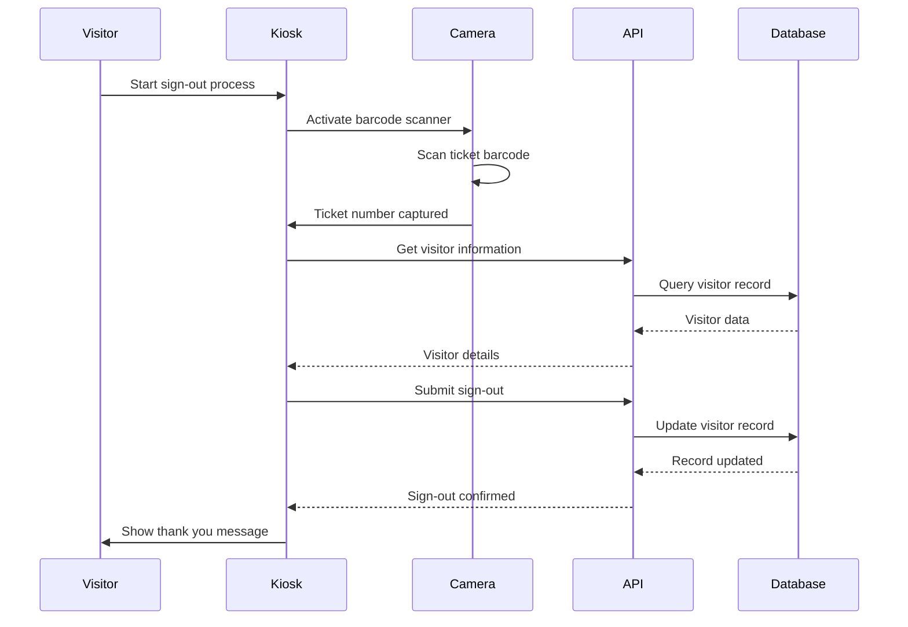

# VMS Kiosk Technical Documentation

## Overview

The VMS (Visitor Management System) Kiosk is a React Native application built with Expo that provides visitor registration, sign-in/sign-out functionality, and rating systems. The application integrates camera functionality for face and ID capture, Bluetooth connectivity for thermal printer support, and various visitor management features.

## Architecture

The application follows a feature-based architecture with the following key components:

- **Camera Module**: Handles face and ID card capture
- **Bluetooth Module**: Manages thermal printer connectivity
- **Visitor Management**: Handles visitor registration and sign-in/out
- **Rating System**: Provides feedback collection
- **Configuration**: Centralized app configuration management

## Camera System

### Camera Types

1. **Face Camera**: Captures visitor's face for identification
2. **ID Camera**: Captures visitor's ID card for verification

### Camera Flow Sequence

### Camera State Management

## Bluetooth Thermal Printer System

### Bluetooth Connection Flow

### Thermal Printer Print Flow

### Bluetooth State Management

## Visitor Management Flow

### Sign-In Process

### Sign-Out Process

## Key Components

### Camera Components

- **useCamera Hook**: Core camera functionality
- **useFaceCameraScreen**: Face capture specific logic
- **useIDCameraScreen**: ID capture specific logic
- **CameraView**: Expo camera component wrapper
- **Camera Controls**: UI controls for camera interaction

### Bluetooth Components

- **useBluetoothPrinter**: Core bluetooth functionality
- **BluetoothClassic**: React Native bluetooth library
- **EscPosEncoder**: Thermal printer command encoder
- **Device Management**: Connection and device handling

### Visitor Management Components

- **useSignInSuccess**: Sign-in completion and printing
- **useSignOutVisitor**: Sign-out with barcode scanning
- **useVisitorRegistrationForm**: Visitor registration
- **API Integration**: Backend communication

## Configuration

The application uses a centralized configuration system:

- **Camera Settings**: Resolution, quality, countdown timing
- **Bluetooth Settings**: Device persistence, connection retry
- **Print Settings**: Ticket format, QR code size, alignment
- **Feature Flags**: Enable/disable specific features

## Error Handling

### Camera Errors
- Permission denied: Show permission request dialog
- Camera initialization failed: Retry with fallback
- Capture failed: Show error message and retry option

### Bluetooth Errors
- Connection failed: Show device selection
- Print failed: Show error and retry option
- Device not found: Guide user to pair device

### Network Errors
- API timeout: Show offline mode
- Data sync failed: Queue for retry
- Configuration load failed: Use defaults

## Performance Considerations

- **Camera**: Optimized image capture and processing
- **Bluetooth**: Connection pooling and device caching
- **Printing**: Async print operations with status feedback
- **Memory**: Image compression and cache management

## Security

- **Permissions**: Granular permission management
- **Data**: Secure storage of visitor information
- **Network**: Encrypted API communication
- **Bluetooth**: Secure device pairing and data transmission

## Testing

### Unit Tests
- Camera functionality
- Bluetooth connectivity
- Print operations
- API integration

### Integration Tests
- End-to-end visitor flow
- Camera to print workflow
- Error handling scenarios

### Manual Testing
- Device compatibility
- Print quality verification
- User experience validation 